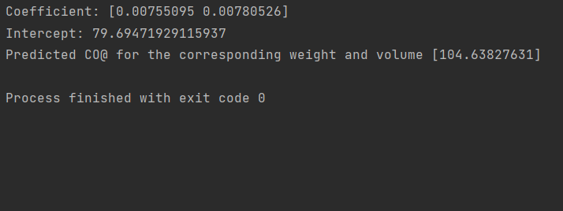

# Implementation of Multivariate Linear Regression
## Aim
To write a python program to implement multivariate linear regression and predict the output.
## Equipment’s required:
1.	Hardware – PCs
2.	Anaconda – Python 3.7 Installation / Moodle-Code Runner
## Algorithm:
### Step1
import pandas as pd.
### Step2
Read the CSV file.
### Step3
Get the value of x and y variables
### Step4
Create the linear regression model and fit.
### Step5
Predict the CO2 emission of a car where the weight is 3200kg, and the volume is 1200cm3.
### Step6
Print the predicted output.
## Program:
```
Developed by: S.M.Syed Mokthiyar
Register number:22006227

import pandas as pd
from sklearn import linear_model
df=pd.read_csv("cars.csv")
x=df[['Weight','Volume']]
y=df['CO2']
regr=linear_model.LinearRegression()
regr.fit(x,y)
print("Coefficient:",regr.coef_)
print("Intercept:",regr.intercept_)
predictedCO2=regr.predict([[3200,1200]])
print("Predicted CO@ for the corresponding weight and volume",predictedCO2)


```
## Output:



## Result
Thus the multivariate linear regression is implemented and predicted the output using python program.
